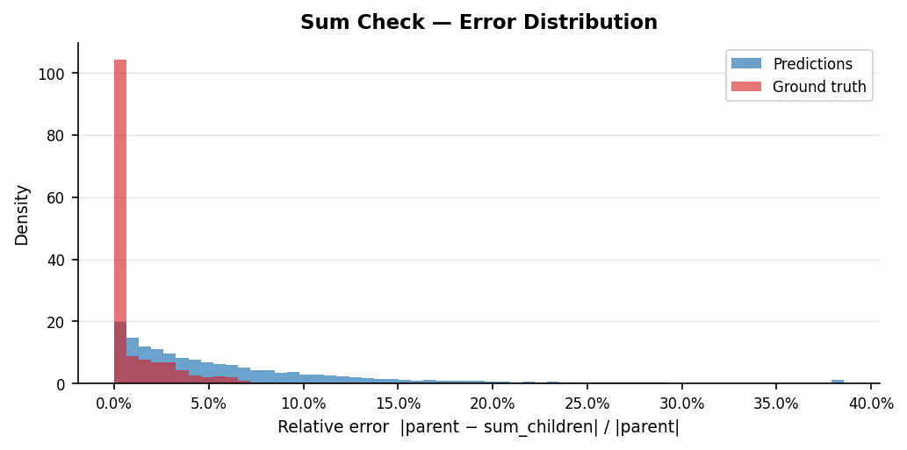
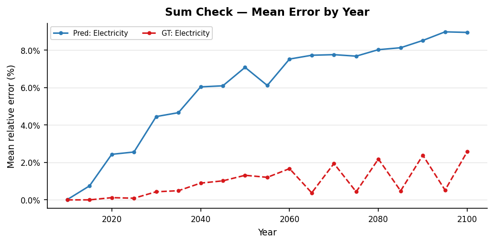
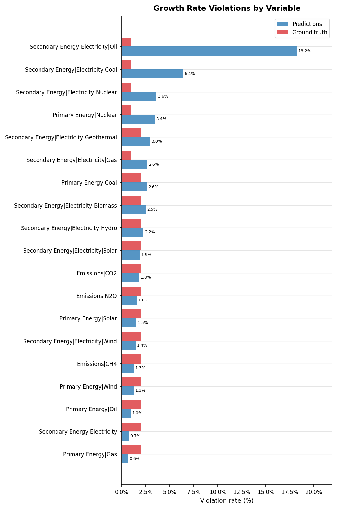
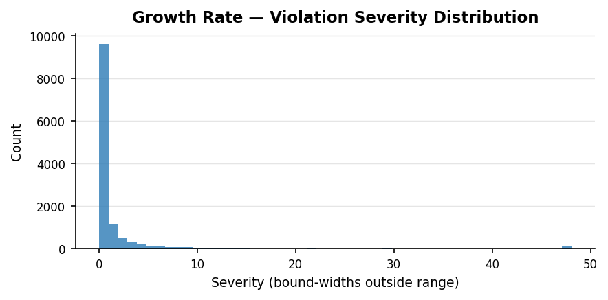
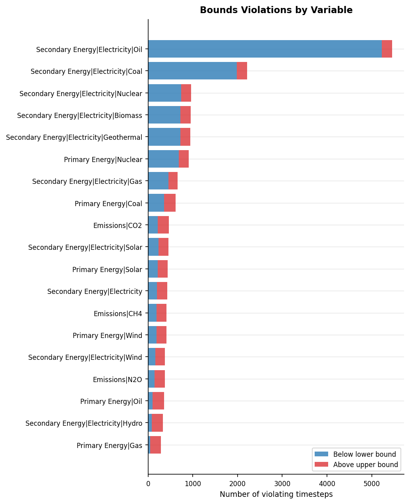
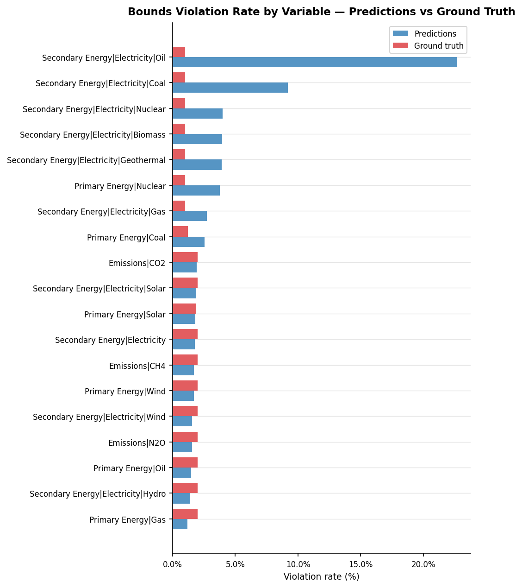

# Validation Report: xgb_04

**Run ID:** `xgb_04`
**Generated:** 2026-04-08 11:18
**Results path:** `results/xgb/xgb_04/`

---

## Overview

| Check | Metric | Predictions | Ground Truth |
| --- | --- | --- | --- |
| Hierarchy Sum Check | Scenario-region pass rate | 0.0% | 56.7% |
|  | Mean relative error | 6.538% | 1.365% |
| Growth Rate Plausibility | Timestep violation rate | 3.0% | 1.8% |
| Physical Bounds Check | Timestep violation rate | 3.72% | 1.59% |

---

## 1. Hierarchy Sum Check

_Checks that predicted parent variables equal the sum of their direct children
at every timestep. Predictions are **expected to fail** this check — the failure
rate quantifies how much the model violates the sum constraint. Compare to the
ground truth pass rate to understand baseline data consistency._

### Pass Rates by Parent Variable

| Parent Variable | Scenario-regions | Pass rate (%) | Mean error (%) | Max error (%) |
| --- | --- | --- | --- | --- |
| Secondary Energy\|Electricity | 1984 | 0.0000 | 6.5384 | 219.8757 |

### Error Distribution

### Mean Error by Year

### Error Percentile Comparison — Predictions vs Ground Truth

| Percentile | Predictions (%) | Ground truth (%) |
| --- | --- | --- |
| p50 | 5.0274 | 0.0025 |
| p75 | 7.9962 | 1.7538 |
| p90 | 12.1709 | 3.6437 |
| p95 | 16.4388 | 5.4734 |
| p99 | 27.9085 | 12.8627 |

---

## 2. Growth Rate Plausibility

_For each predicted trajectory, checks that the 5-year period-on-period growth rate
falls within the 1st–99th percentile range observed in the AR6 test-set ground truth.
Empirical bounds are derived per variable._

**Total timesteps evaluated:** 419,995  
**Violations:** 12,786 (3.04%)  
**Median severity** (violations only): 0.257 bound-widths  

**Ground truth — violation rate:** 1.76%  
**Ground truth — median severity:** 0.148 bound-widths  
_(+1.28pp difference: predictions vs ground truth)_

### Violation Rate by Variable

### Empirical Bounds Used (AR6 test-set percentiles)

| Variable | Lower bound | Upper bound |
| --- | --- | --- |
| Emissions\|CH4 | -0.3477 | 0.1688 |
| Emissions\|CO2 | -8.2397 | 0.5696 |
| Emissions\|N2O | -0.3593 | 0.1809 |
| Primary Energy\|Coal | -0.9983 | 1.6217 |
| Primary Energy\|Gas | -0.7501 | 0.8492 |
| Primary Energy\|Nuclear | -1.0000 | 2.1344 |
| Primary Energy\|Oil | -0.9504 | 0.5854 |
| Primary Energy\|Solar | -0.0949 | 7.8881 |
| Primary Energy\|Wind | -0.1478 | 8.9436 |
| Secondary Energy\|Electricity | -0.0910 | 0.6844 |
| Secondary Energy\|Electricity\|Biomass | -0.9989 | 10.3980 |
| Secondary Energy\|Electricity\|Coal | -1.0000 | 3.0881 |
| Secondary Energy\|Electricity\|Gas | -1.0000 | 1.6098 |
| Secondary Energy\|Electricity\|Geothermal | -0.4082 | 15.3420 |
| Secondary Energy\|Electricity\|Hydro | -0.1387 | 0.7377 |
| Secondary Energy\|Electricity\|Nuclear | -1.0000 | 2.0819 |
| Secondary Energy\|Electricity\|Oil | -1.0000 | 3.1086 |
| Secondary Energy\|Electricity\|Solar | -0.1054 | 9.0838 |
| Secondary Energy\|Electricity\|Wind | -0.1557 | 9.0326 |

### Severity Distribution

_Severity = how many bound-widths the growth rate exceeds the limit._

### Violation Rate by Scenario Category

| Category | Timesteps | Violations | Violation rate (%) |
| --- | --- | --- | --- |
| C6 | 42883 | 1490 | 3.4700 |
| C4 | 60743 | 2035 | 3.3500 |
| C2 | 48716 | 1603 | 3.2900 |
| C1 | 29697 | 930 | 3.1300 |
| C3 | 123215 | 3839 | 3.1200 |
| C5 | 66880 | 1865 | 2.7900 |
| C7 | 34694 | 906 | 2.6100 |
| C8 | 3097 | 79 | 2.5500 |
| no-climate-assessment | 10070 | 39 | 0.3900 |

---

## 3. Regional Consistency

_Checks that predicted World values equal the sum of predicted subregion values
(R5 / R6 / R10 groupings). Only checked for scenarios where a complete grouping
is present. Predictions are **expected to fail** if the model predicts regions
independently of World._

_Regional consistency results not found. Run `regional_consistency.py` first, or skip if your run has no multi-region scenarios._

---

## 4. Physical Bounds Check

_Checks predicted values against hard physical lower bounds (energy variables ≥ 0)
and empirical per-variable bounds derived from the AR6 test-set ground truth._

**Timesteps checked:** 457,691  
**Violations:** 17,041 (3.723%)  
**Fully clean scenario-regions:** 32,149 / 37,696

### Bounds Applied

| Variable | Lower bound | Upper bound |
| --- | --- | --- |
| Primary Energy\|Coal | 0 | 1.885e+05 |
| Primary Energy\|Gas | 22.05 | 2.006e+05 |
| Primary Energy\|Oil | 0.2682 | 2.024e+05 |
| Primary Energy\|Solar | 4.163 | 1.517e+05 |
| Primary Energy\|Wind | 4.211 | 1.205e+05 |
| Primary Energy\|Nuclear | 0 | 5.49e+04 |
| Emissions\|CO2 | -4362 | 4.188e+04 |
| Emissions\|CH4 | 0.4528 | 379 |
| Emissions\|N2O | 16.78 | 1.291e+04 |
| Secondary Energy\|Electricity | 666.4 | 3.737e+05 |
| Secondary Energy\|Electricity\|Biomass | 0 | 2.043e+04 |
| Secondary Energy\|Electricity\|Coal | 0 | 4.069e+04 |
| Secondary Energy\|Electricity\|Gas | 0 | 3.94e+04 |
| Secondary Energy\|Electricity\|Geothermal | 0 | 4205 |
| Secondary Energy\|Electricity\|Hydro | 1.834 | 3.401e+04 |
| Secondary Energy\|Electricity\|Nuclear | 0 | 5.185e+04 |
| Secondary Energy\|Electricity\|Oil | 0 | 3919 |
| Secondary Energy\|Electricity\|Solar | 3.7 | 1.292e+05 |
| Secondary Energy\|Electricity\|Wind | 3.609 | 1.176e+05 |

### Violations by Variable

### Predictions vs Ground Truth

| Source | Timesteps | Violations | Violation rate |
| --- | --- | --- | --- |
| Predictions | 457,691 | 17,041 | 3.723% |
| Ground truth | 457,691 | 7,257 | 1.586% |

_Predictions show +2.138 pp more violations than ground truth._

### Violation Rate by Variable — Predictions vs Ground Truth

